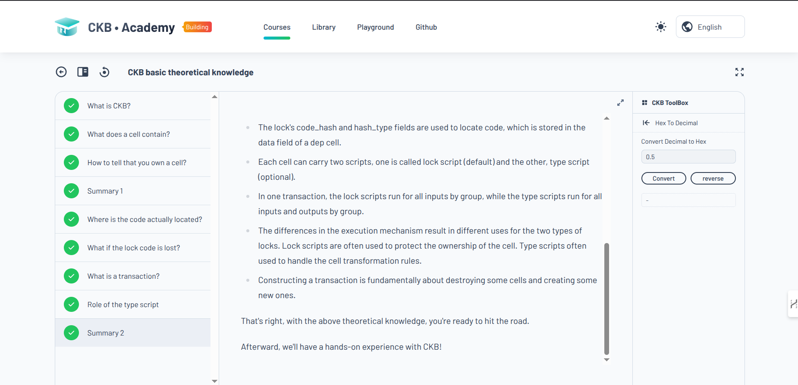
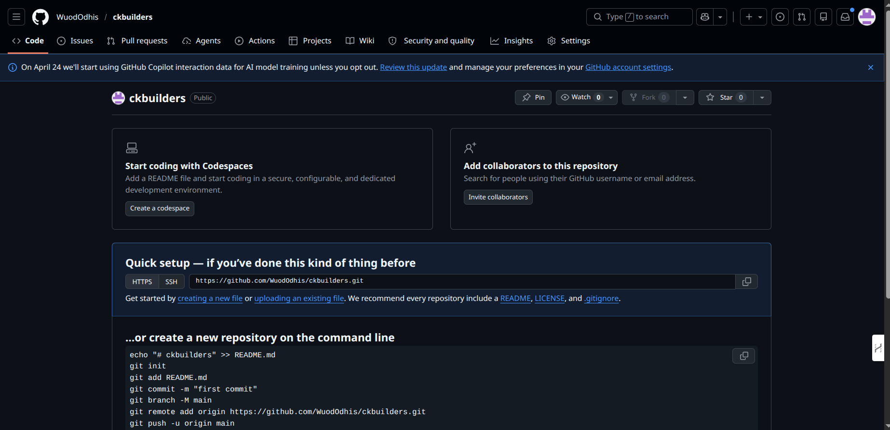
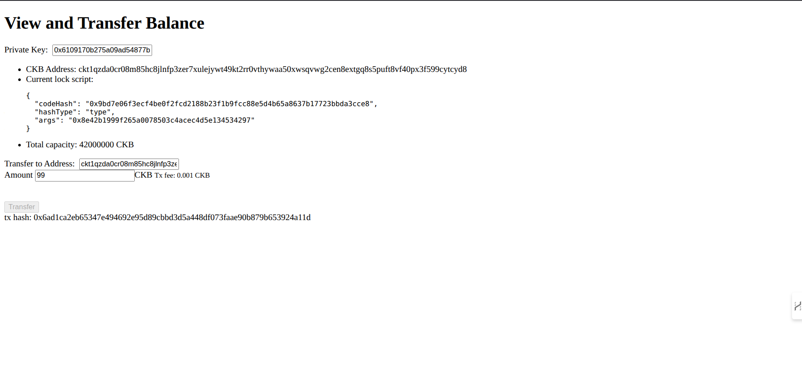
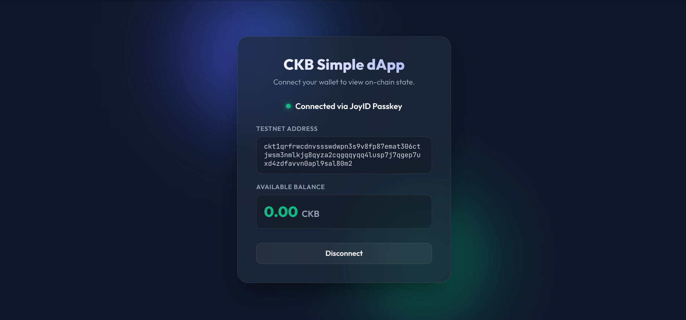
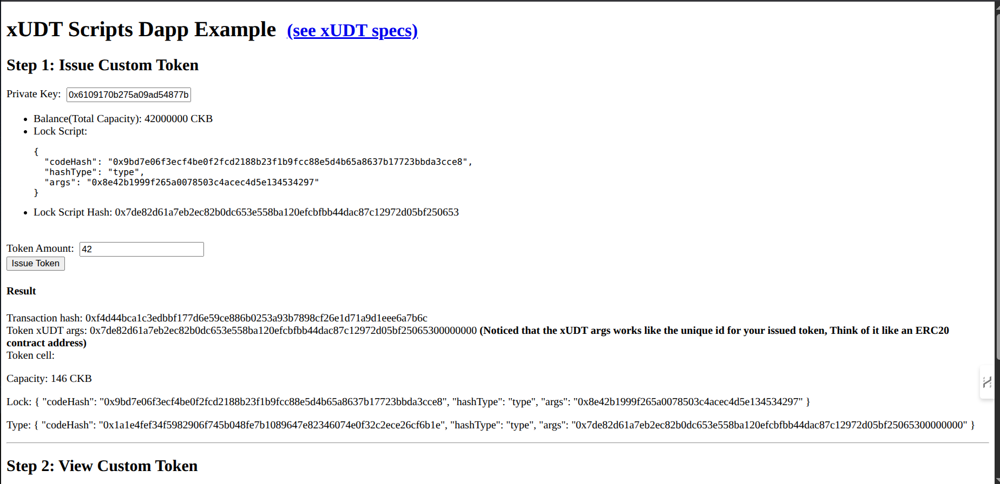

#  CKBuilders: AI Agent Architecture on CKB

A deep-dive exploration into building autonomous, AI-agent-driven systems on the Nervos Common Knowledge Base (CKB). This repository tracks my journey through the CKBuilders program, focusing on the intersection of **PoW Security**, **UTXO Scalability**, and **Autonomous Logic**.

##  Core Objectives
1. **Master the Cell Model:** Transition from account-based paradigms to cell-oriented development.
2. **AI-Agent Integration:** Explore how CKB's off-chain computation and on-chain verification enable highly parallelized agent operations.
3. **PoW + UTXO Synergies:** Leverage the security of Proof of Work and the concurrency of UTXOs for scalable agent economies.

##  Repository Structure
- `logs/`: Daily technical logs and "Aha!" moments.
- `concepts/`: Deep dives into CKB architecture, scripts, and cell logic.
- `experiments/`: Proof-of-concept scripts and local devnet tests.
- `weekly-reports/`: High-level summaries of progress and key learnings.
- `capstone/`: The final project implementation.

##  Environment
- **Node:** v20.x
- **CLI:** OffCKB
- **Framework:** Lumos (JS/TS SDK for CKB)

---

##  Project Showcase

### Week 1: Foundations & First Transactions

**CKB Academy — Theoretical Foundations**

**GitHub Repository Setup**

**First CKB Transfer (99 CKB via Simple Transfer dApp)**

### Week 2: Practical Application & Tooling

**CKB Simple dApp — Connected via JoyID Passkey**

**xUDT Token Issuance Interface**

---

> "The Cell Model isn't just a way to store state; it's a way to architect autonomy." — Day 1 Reflection.
