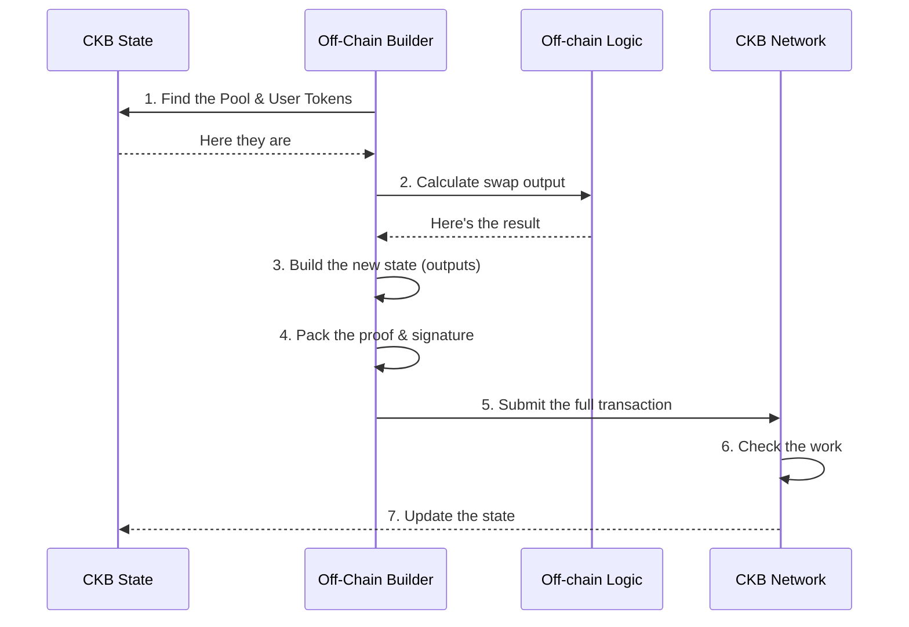

*There is a hidden worker behind every CKB transaction. Once you understand who it is, the whole blockchain makes sense.*

---

When you swap tokens on a platform like Uniswap, it feels simple. You click a button, something happens on-chain, and your wallet balance changes. It's almost magical.

But that magic is a lie — or at least, it's hiding a lot of work. The real question is: **who did the work, and where?**

On most blockchains, the answer is: *the blockchain itself.* You tell it what to do, and it figures out the details. On Nervos CKB, the answer is completely different — and understanding why that matters is the whole point of this post.

---

## How Ethereum Works (The "Tell Me What To Do" Model)

Think of Ethereum like a restaurant where you order from the menu.

You (the user) say: *"I want a token swap."* Your wallet sends that request to the blockchain. The blockchain's computer (called the EVM) figures out all the math — how many tokens you get, what the new pool balances are — and updates everything. You never had to think about how.

This is comfortable. But it has a hidden cost:
- Every single node on the network runs all that math. Thousands of computers doing the same calculation. That's why gas fees get expensive during busy times.
- Everything happens one after another. No two transactions can run at exactly the same time, which puts a ceiling on how fast the network can go.
- You can't easily check what a transaction will do before it's already done.

These aren't mistakes. Ethereum was designed this way to make things easy for developers. But the tradeoffs become real when you push it hard.

---

## How CKB Works (The "Show Me Your Work" Model)

CKB is like a math teacher who won't just accept your answer. You have to **show your work**.

The CKB blockchain does not do any computing. Instead, it only **checks** transactions that someone else has already figured out.

Here's the CKB model in plain terms:

> "These specific coins exist right now. After this transaction, *these* new coins will exist instead. Here's proof that I followed all the rules."

The blockchain's job is only to confirm:
1. The coins you're spending actually exist (and haven't been spent already).
2. The owners of those coins agreed to spend them (signed off).
3. All the rules of the contract were followed.
4. No new coins were magically created out of thin air.

That's it. The blockchain does not figure out the new balances. **You do.** Before you even submit the transaction.

---

## So Who Does the Work?

This is where the **External Builder** comes in.

The Builder is an off-chain program (running on a regular computer, not the blockchain) whose job is to do all the thinking before the transaction is submitted. It's called "external" because it lives completely outside the blockchain — the chain never sees it, only its finished output.

For something as "simple" as a token swap, here's what the Builder has to do:

1. **Find the right coins.** Look up the AMM pool and the user's token balance.
2. **Read the current state.** What are the current reserves in the pool?
3. **Do the math.** Calculate how many tokens the user gets out, based on the pool's formula.
4. **Check slippage.** Make sure the user gets at least the minimum they're willing to accept.
5. **Build the new state.** Create the updated pool (with new balances) and the new token for the user.
6. **Attach the rules.** Reference the contracts so the chain knows which rules to apply.
7. **Pack the proof.** Include metadata saying which action was taken.
8. **Sign and send.** The user signs the whole package, and it's broadcast to the chain.

Every single one of those steps is the Builder's job. The chain only receives the finished product, checks it, and says yes or no.

This diagram shows the flow:



---

## Why Is This Better?

The honest first reaction to this is: *"That sounds like so much more work."* And it is. But here's what you get in return.

**It's faster and cheaper at scale.**

The heavy computation happens on regular computers — yours, or a specialized server — not on thousands of blockchain nodes at once. The blockchain only checks math, which is fast. This means adding more nodes to CKB doesn't create more bottlenecks. The network can scale more naturally.

**The Builder can be as smart as you need.**

On Ethereum, a smart contract can't loop too many times or it runs out of gas and fails. The Builder on CKB has no such limit. You could run a complex order-matching algorithm across thousands of users, find the optimal batching, and submit one perfect transaction. All that logic runs at full computer speed, off-chain.

**You can audit a transaction before submitting it.**

Because the Builder constructs the complete before-and-after picture, you can inspect it first. Did the math work out correctly? Is slippage within limits? You can catch mistakes before they cost fees. On Ethereum, you have to simulate and hope the live state hasn't changed by the time your transaction runs.

**Two transactions can run at the same time.**

If Alice and Bob are doing transactions that don't touch the same coins, CKB can validate them in parallel. There's no shared queue forcing everything to wait its turn. Parallelism is the default — not a hard engineering problem to solve later.

---

## The One Big Problem Right Now

There is a real challenge that honesty requires mentioning.

**What if Alice and Bob both try to swap using the same pool at the same moment?**

Both Builders pick up the same pool state, calculate their results, and race to submit. Whoever lands first wins. The second transaction fails because the pool it was looking at no longer exists — it was already updated by Alice's transaction.

On Ethereum, the network queues them and handles it. On CKB, the second one simply crashes.

The proposed solution is called **CoBuild Open Transactions (OTX)**. Instead of submitting full transactions, users sign a statement of *intent* — "I want to swap 100 USDT for at least 95 USDC." A specialized agent called a **Solver** collects these intents, batches compatible ones together, resolves the conflict, and submits one valid transaction that satisfies everyone. The Solver earns a fee for this.

This is a clean solution in theory. But the infrastructure to run it is still being built. There's no production-ready Solver network today. This is the biggest gap between what CKB promises and what you can build with it right now.

---

## What CellScript Adds

CellScript is a programming language built specifically for writing CKB contracts. It's designed around the "show your work" model from the ground up.

The key idea is the **resource** — a typed definition of what lives in a coin:

```cellscript
shared Pool has store, create, replace {
    reserve_a:    u64,
    reserve_b:    u64,
    total_lp:     u64,
    fee_rate_bps: u16,
}

resource Token has store, create, consume, replace {
    amount: u64,
    symbol: [u8; 8],
}
```

A `shared Pool` is a coin that any Builder can update — as long as they follow the rules. A `Token` is a coin owned by a specific user. These aren't abstractions. They *are* the coins, just with names and types.

The contract logic lives in **actions** — declared state transitions that say exactly what goes in, what comes out, and what rules must hold:

```cellscript
action swap_a_for_b(
    pool_before: Pool,
    input:       Token,
    min_output:  u64,
    to:          Address,
) -> (pool_after: Pool, token_out: Token)
where
    let fee        = input.amount * pool_before.fee_rate_bps as u64 / 10000
    let net_input  = input.amount - fee
    let amount_out = (net_input * pool_before.reserve_b)
                     / (pool_before.reserve_a + net_input)

    assert(amount_out >= min_output, "slippage exceeded")
    ...
```

Notice what's explicit here: what's consumed, what's created, what math must hold. The chain verifies this. The Builder runs it first.

---

## The ProofPlan: A Contract's Note to Its Builder

Here's where CellScript gets clever.

When you compile a CellScript contract, it outputs not just the code that runs on-chain, but a `proof_plan` file — a structured description of every rule the contract enforces:

```json
{
  "action": "swap_a_for_b",
  "reads": ["pool.reserve_a", "pool.reserve_b", "pool.fee_rate_bps", "token.amount"],
  "builder_assumptions": [
    "pool_output.reserve_a == pool_input.reserve_a + net_input",
    "pool_output.reserve_b == pool_input.reserve_b - amount_out",
    "token_output.amount >= min_output"
  ]
}
```

This is a plain-language checklist of everything the Builder must satisfy before the chain will approve the transaction.

For a human developer, it's documentation. For an AI agent, it's an instruction set.

An AI agent can read this file, understand the invariants of the contract, and construct valid transactions autonomously — without needing to read compiled bytecode or reverse-engineer anything. And if the agent gets it wrong, the chain rejects the transaction. The correctness is enforced by math, not trust.

This points toward where CKB's architecture is heading: a world where users broadcast signed *intents*, and smart agents compete to fulfill them in the most efficient way possible — with the blockchain as the final, incorruptible judge.

---

## What's Still Missing

Being honest about the current state:

**1. A bootstrap registry.** Every CKB protocol starts with "genesis coins" — the initial pool, the permission tokens, the deployed contract code. Right now, figuring out how to find these is scattered across deployment docs and Discord messages. There should be a standard way to discover a protocol's full setup from just its contract ID.

**2. A shared Builder toolkit.** Every protocol reinvents the same wheel: finding coins, estimating fees, building transaction skeletons. This should be a library. The foundation (CCC SDK) exists; it needs a higher layer that reads a ProofPlan and generates the transaction structure automatically.

**3. A live OTX Solver network.** The contention problem (two Builders racing for the same coin) doesn't go away until there's real infrastructure to solve it — a standard API, a public solver registry, and easy tooling for protocol developers to plug into.

**4. Local simulation before broadcast.** The Builder should be able to run the contract locally and confirm "this will succeed" before asking the user to sign. A developer tool for this exists (`cellc validate-tx`). It needs to become a standard library that any dApp can call.

---

## The Bottom Line

The External Builder is not an inconvenient workaround. It's the entire point of how CKB works.

When the blockchain only *verifies*, someone else has to do the *thinking*. That someone is the Builder. The blockchain's scripts define the rules. The Builder applies those rules to the current state of the world and constructs a transaction that proves everything checks out.

What makes this hard right now isn't the model — the model is genuinely elegant. It's that the tooling to work with it is still young. The pieces are there: CellScript for typed contracts, CKB-VM for fast verification, CCC for transaction building. The missing piece is the glue that makes it feel like one thing instead of several separate things.

That's the work being done. And it's worth doing, because the payoff is significant: **parallel execution by default, auditable transactions, computation that scales with your hardware instead of being bottlenecked by the network.**

A blockchain that only checks your work will always be able to check more work than a blockchain that does the work itself.

---

*This is part of an ongoing series documenting progress through the CKBuilders program. Previous posts cover the Cell Model's ownership semantics and the architectural case against the account model. The next piece will cover what happens when the bootstrap problem is solved and the first real AMM swap finally runs end-to-end.*
