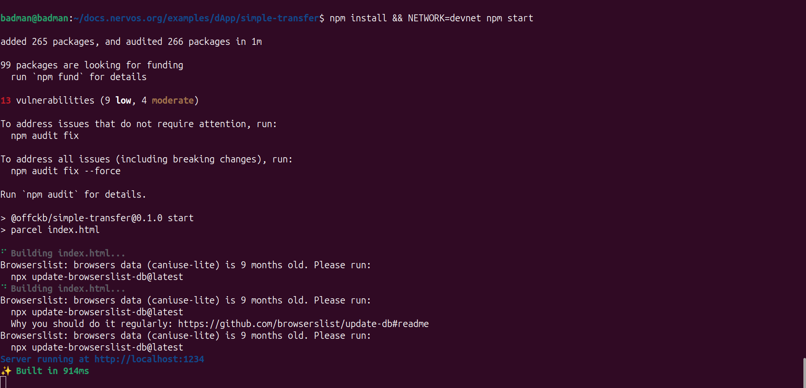

# Day 2: CKB Transfers

**Date:** April 24, 2026

## Transaction Construction
Built a CKB transfer boilerplate. Process involves:
- Fetching input cells.
- Creating output cells.
- Adding witness for authorization.

## Progress
- Verified transfer logic on local devnet.
- Documented cell destruction/creation cycle.

