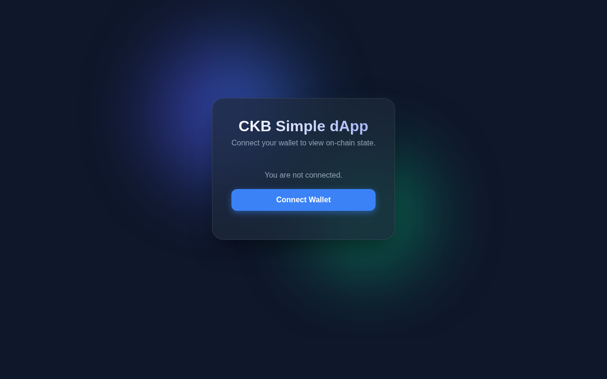

# Day 4: Lock & Type Scripts

**Date:** April 26, 2026

## Script Architecture
- **Lock Script:** Defines ownership (authorization to spend).
- **Type Script:** Defines asset rules (minting, uniqueness).

## Progress
- Analyzed script structure (`code_hash`, `hash_type`, `args`).
- Set up `day-4-asset-factory` React project.

