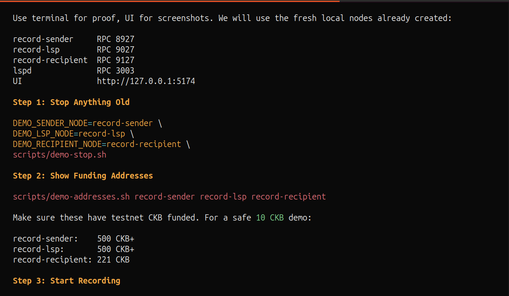

# Day 1: Turning Fiber Research Into an LSP Direction

**Date:** July 12, 2026

## Objective

Move from Week 10 Fiber research into an actual hackathon build. The goal was to
choose a narrow Fiber infrastructure problem that could be demonstrated with the
current node RPC surface instead of requiring protocol changes.

## Project Direction

The chosen direction is a receive-first Fiber LSP.

The problem is that a new wallet, merchant, or service may want to receive a
Fiber payment before it has inbound liquidity. The prototype solves this by
placing a small daemon beside a funded Fiber node. The daemon sells a
sender-facing invoice, provisions recipient-side liquidity when needed, pays the
recipient over Fiber, and then settles the sender invoice.

The claim is intentionally limited:

```text
The recipient does not pre-fund inbound liquidity.
The recipient still needs a small CKB reserve for Fiber/CKB channel acceptance.
```

That framing keeps the project aligned with what Fiber can do today.

## Initial Architecture

The first architecture has three Fiber nodes:

- sender;
- LSP;
- recipient.

The LSP daemon talks to the LSP Fiber node over JSON-RPC. The sender pays an LSP
invoice, and the LSP handles the recipient-side channel/payment work.

The initial daemon API is small:

- `get_info`;
- `buy`;
- `get_order_status`.

The demo was organized around a short checklist so the proof could show terminal
state and UI state separately:



## Implementation Start

Started the Rust `lspd` crate and added the first Fiber RPC client methods:

- `node_info`;
- `connect_peer`;
- `list_peers`;
- `new_invoice`;
- `get_invoice`;
- `open_channel`;
- `list_channels`;
- `settle_invoice`.

Also added the first order model and state-machine boundary. The key early states
are:

```text
AWAITING_PAYMENT
PAYMENT_HELD
OPENING_CHANNEL
CHANNEL_READY
SETTLING
COMPLETED
FAILED
```

## Result

By the end of the day, the project had a clear shape: a Fiber-native LSP daemon
that coordinates an invoice, recipient channel provisioning, and settlement.

The important design choice was not to invent a marketplace or custom payment
protocol. The prototype stays close to current Fiber RPCs so the demo can be
tested on real testnet nodes.

## Next

Implement the order watcher loop:

- poll invoice state;
- detect sender payment;
- open the recipient channel;
- wait for `ChannelReady`;
- settle the sender invoice.
