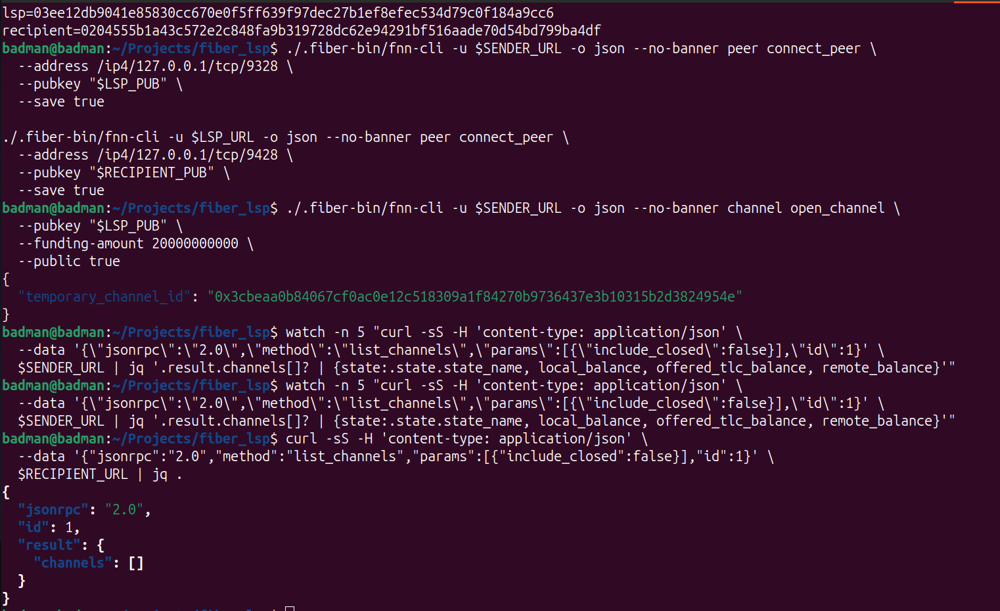
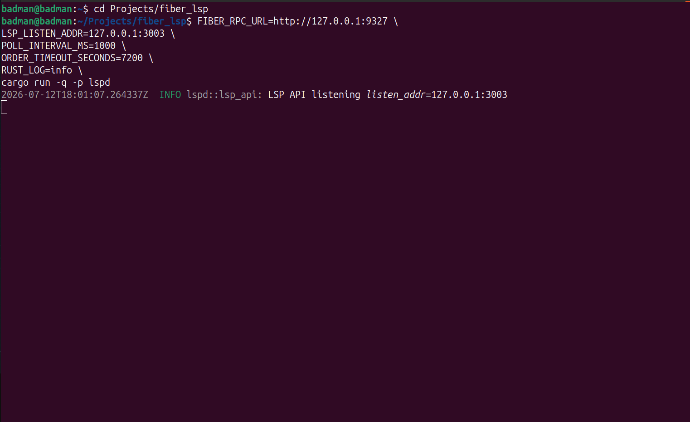

# Day 2: Order Watchers and Real Fiber State

**Date:** July 13, 2026

## Objective

Turn the basic LSP API into a working state machine driven by real Fiber node
state. The main goal was to stop treating RPC responses as a mock flow and make
the daemon wait for actual invoice and channel transitions.

## Watcher Implementation

Added watcher loops for:

- invoice polling;
- channel readiness polling;
- order execution;
- timeout handling.

The daemon now creates an order through `buy`, then moves it forward based on
Fiber state instead of immediate assumptions.

The first version of the flow was:

1. create hold invoice;
2. wait for invoice status `Received`;
3. open a channel to the recipient;
4. wait for `ChannelReady`;
5. settle the sender invoice.

## RPC Shape Fixes

Several Fiber RPC details had to be handled carefully.

First, `ChannelReady` responses can omit `state_flags`. The model now defaults
that field instead of failing deserialization.

Second, `open_channel` returning a temporary channel id is not enough. It only
means the opening attempt started. The daemon must keep polling `list_channels`
until the channel reaches `ChannelReady` or reports a failure.

Third, stale failed channels should not block a newer opening attempt. The
channel watcher now filters channel observations by creation time around the
current order transition.

## Audit Trail

Added order events so a demo or integration can see how the order moved:

```text
AWAITING_PAYMENT | hold invoice created
PAYMENT_HELD     | Fiber invoice status changed to Received
OPENING_CHANNEL  | starting Fiber channel open to recipient
CHANNEL_READY    | Fiber channel reached ChannelReady
SETTLING         | settling Fiber hold invoice
COMPLETED        | Fiber invoice settled
```

This is useful because Fiber operations are asynchronous. The user-facing flow
needs visible state, not just a final success/failure boolean.

The clean-state proof starts with the recipient node reporting no open channels:



The LSP daemon then exposes the local JSON-RPC API that drives the order flow:



## Result

The daemon could create an order, observe a held sender payment, open a recipient
channel, and settle the invoice after channel readiness.

At this point the flow still had an important product gap: opening a channel and
settling the sender invoice does not by itself prove the recipient was paid. The
next step was to add an explicit recipient-side payment before settlement.

## Next

Add `send_payment` and `get_payment` support so the LSP pays the recipient net
amount over Fiber before settling the sender invoice.
