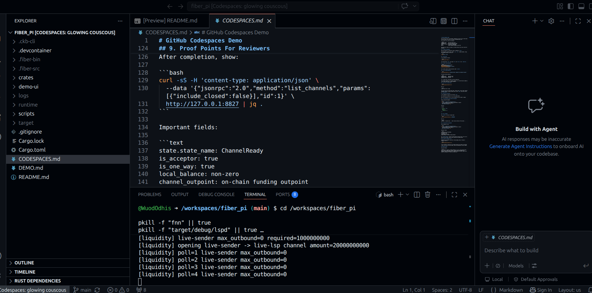

# Day 4: Codespaces Demo and Submission Cleanup

**Date:** July 15, 2026

## Objective

Make the hackathon project presentable and testable. The core LSP flow was
working, but the demo environment needed to be repeatable enough for a live
review.

## Demo Script Hardening

The early scripts were too fragile because they assumed a fixed liquidity amount
and did not handle stale node processes well. I rewrote the demo startup path so
it now:

- starts only the configured node set;
- checks configured ports before starting nodes;
- connects sender to LSP and LSP to recipient;
- verifies peer visibility;
- opens sender-to-LSP liquidity only if needed;
- checks usable outbound liquidity against the configured payment amount;
- verifies recipient open-channel count;
- starts `lspd`;
- starts the browser UI.

This made the demo more predictable and reduced the number of manual commands
needed to show the flow.

## Codespaces Deployment

Added a Codespaces deployment path because the hackathon requires a live testable
demo and a VPS was not always practical.

The Codespace runs the full testnet stack:

- sender Fiber node;
- LSP Fiber node;
- recipient Fiber node;
- `lspd`;
- demo UI on forwarded port `5173`.

Only the UI is public. The Fiber RPC ports stay local inside the Codespace.

Added:

- `.devcontainer/devcontainer.json`;
- `CODESPACES.md`;
- `scripts/codespaces-demo-start.sh`;
- `scripts/codespaces-demo-pay.sh`.

The Codespaces setup starts the live testnet stack from the repository and keeps
the Fiber RPC ports local while exposing the browser demo UI.

## Documentation Cleanup

Cleaned the public project docs so they read as project documentation rather than
private implementation notes.

The public docs are now:

- `README.md`, for project overview, claim, API, limitations, and setup;
- `DEMO.md`, for a local/testnet demo runbook;
- `CODESPACES.md`, for live Codespaces deployment.

Internal milestone notes and RPC capture notes were removed from the tracked
repository. Runtime files, logs, Fiber binaries, downloaded Fiber source, and
local CKB tooling remain ignored.

## Current Status

The project is ready as a hackathon infrastructure demo:

- the receive-first LSP flow works on Fiber testnet;
- the recipient starts with zero channels;
- the LSP provisions recipient-side liquidity;
- the recipient receives Fiber local balance;
- the sender invoice is settled only after recipient payment succeeds;
- the on-chain channel funding transaction is visible through `channel_outpoint`.

## Next

Prepare the final live Codespaces node set for review and keep the demo state
clean until it is used.
