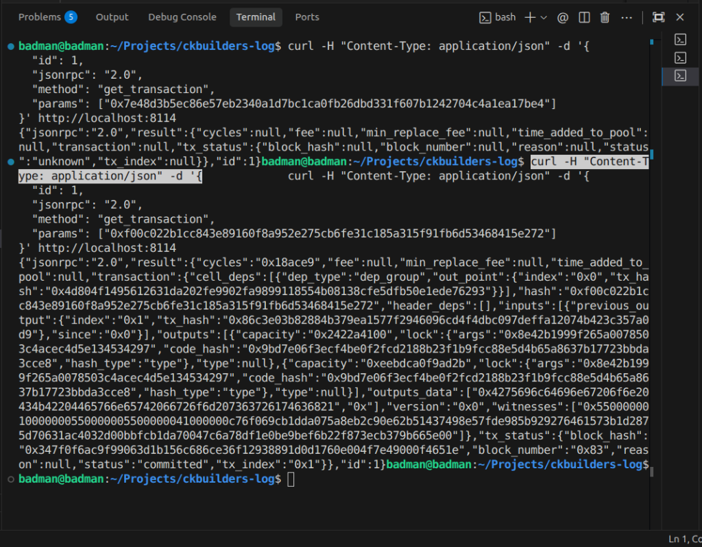
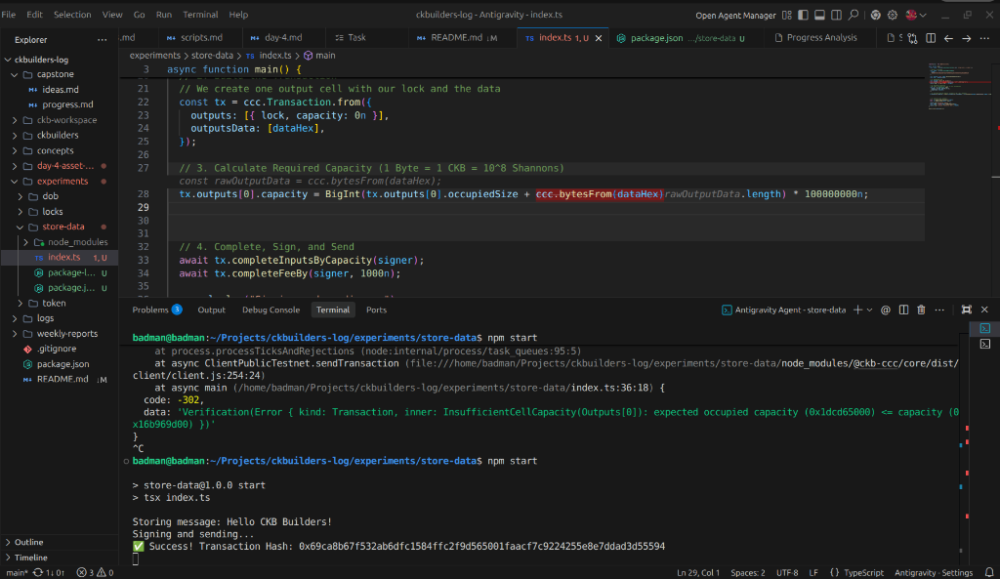

# Week 2, Day 2: Storing Data on Cells

## Objective
Learn how to store arbitrary data within a cell on the CKB local devnet using the CCC SDK, completing the "Store Data on Cell" exercise from the handbook.

## Progress & Technical Learnings

### 1. Devnet vs. Testnet Configuration
While the standard CCC `ClientPublicTestnet` is configured for the public testnet, we discovered that it hardcodes testnet-specific outpoints for System Scripts (like the `Secp256k1Blake160` lock script). 

Because my local `offckb node` generates a fresh chain, the system scripts live at different transaction hashes. To fix the `Unknown(OutPoint)` resolution errors, I had to patch the CCC client configuration locally by overriding the `Secp256k1` script outpoint to point to the correct devnet transaction hash:
`0x4d804f1495612631da202fe9902fa9899118554b08138cfe5dfb50e1ede76293`

### 2. Calculating Occupied Capacity
CKB requires exact calculation for the space a cell consumes. Initially, using `tx.outputs[0].occupiedSize` only calculated the size of the Lock Script (~61 CKB bytes). 

When adding data to the cell via the `outputsData` array, the required capacity must account for the byte length of that data. I fixed the `InsufficientCellCapacity` error by explicitly adding the length of the data hex to the calculation:
```typescript
tx.outputs[0].capacity = BigInt(tx.outputs[0].occupiedSize + ccc.bytesFrom(dataHex).length) * 100000000n;
```

### 3. Verification via RPC
After successfully creating the transaction, I verified that the data was actually committed to the blockchain by hitting the local node's RPC directly with `curl` using the `get_transaction` method. 

The `outputs_data` array returned `0x4275696c64696e67206f6e20434b42204465766e65742066726f6d207363726174636821`, which is the hex equivalent of my message: "Building on CKB Devnet from scratch!"

## Proof of Execution

**Executing the script and successfully signing/sending the transaction:**


**Querying the local RPC to verify the `outputs_data` is committed:**

