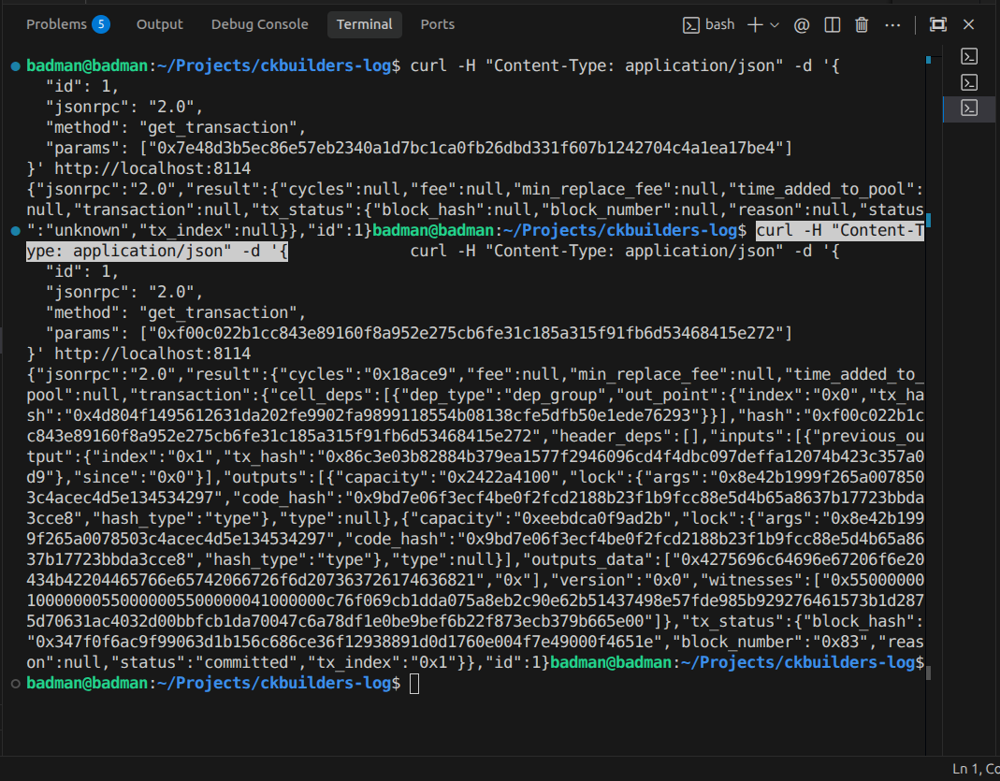

# Week 3, Day 1: Advanced Transaction Construction & The Asset Factory

## Objective
Transition from theoretical understanding of Layer 2 (Fiber) to practical, complex on-chain interactions by completing the "Asset Factory" dApp.

## Progress Overview
Today marks the start of Week 3. We bridged the gap between Week 2's theoretical study of the Fiber Network and the actual implementation of asset management logic.

### 1. Implementing xUDT Transfer Logic
We successfully integrated xUDT transfer capabilities into the `day-4-asset-factory` project. This involved:
- **State Management:** Tracking both CKB and xUDT balances in real-time.
- **Input Collection:** Using the CCC SDK to automatically gather the correct token cells for a transfer.
- **Transaction Completion:** Chaining `completeInputsByUdt`, `completeInputsByCapacity`, and `completeFeeBy` to handle the complexities of the Cell Model (state rent and change cells) automatically.

### 2. UI/UX Enhancements
The dApp was upgraded with a premium **Glassmorphism** interface, including:
- A **Stats Grid** for clear balance visualization.
- A **Transfer Form** with validation for recipient addresses and amounts.
- Dynamic status indicators for wallet connectivity.

## Technical Insights: The "Magic" of CCC Completers
One of the biggest "Aha!" moments today was seeing how the CCC SDK handles **Change Cells**. On CKB, if you spend a cell, you spend the *whole* cell. If you only want to send 10% of its contents, the SDK must create a new "Change Cell" with the remaining 90% and send it back to you. 
The line `await tx.completeInputsByUdt(signer, xudtTypeScript)` handles all of this logic in a single call, which is a massive productivity boost compared to manual transaction construction.

## Next Steps for Week 3
- [ ] **Day 2:** Deep dive into the CKB-VM. How does RISC-V allow CKB to run any logic?
- [ ] **Day 3:** Introduction to **Capsule** — the Rust-based framework for writing CKB scripts.
- [ ] **Day 4:** Writing and deploying a custom "Always Success" lock script to the devnet.
- [ ] **Day 5:** Understanding Script Verification & Witness handling.

---

## Screenshots

### Raw RPC Transaction Queries
Exploring CKB's JSON-RPC interface directly via `curl` to understand how transactions are structured at the protocol level:

### Token Minting Experiment — Success!
Successfully minted 1,000,000 tokens using a custom script in the `experiments/token` directory:

### Asset Factory dApp — Glassmorphism UI
The upgraded Asset Factory interface with premium glass design, running on `localhost:5173`:

### Wallet Integration — JoyID + Developer Login
Dual authentication flow supporting both JoyID passkey wallet and developer private key login:

---

*Week 3 is about moving from being a user of the network to being a builder of the network's rules.*
