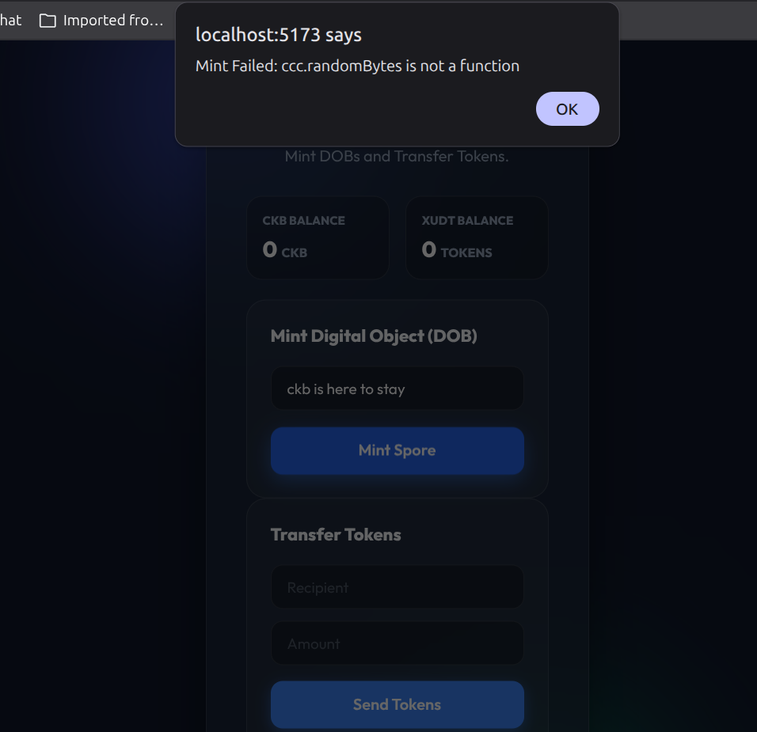

# Week 3, Day 2: The Spore Protocol & Digital Objects (DOBs)

## Objective
Complete the "Beginner" track requirements by implementing the Spore Protocol to mint on-chain Digital Objects (DOBs).

## Progress Overview
Today, we returned to the foundational exercises of the CKB Handbook to ensure we haven't missed any key milestones. We integrated the Spore Protocol into the `CKB Asset Factory`.

### Key Learnings: What is a Spore?
Unlike traditional NFTs that store metadata off-chain (like on IPFS or a centralized server), a **Spore** is an on-chain Digital Object.
1. **On-Chain Content:** The data (text, image, etc.) is stored directly in the cell's `data` field.
2. **Intrinsic Value:** Because 1 CKB = 1 Byte, a Spore that stores 100 bytes of data literally contains 100 CKB. It "owns" its own storage space.
3. **No Trust Required:** Since the asset is on-chain, it cannot be "deleted" or changed by a server admin. It is as permanent as the blockchain itself.

## Implementation: Minting a DOB
We added a new section to our dApp that allows us to:
- Define the **Content Type** (e.g., `text/plain`).
- Define the **Content** (any message or data).
- Generate a unique **Spore ID** using a TypeID-style logic.
- Construct and broadcast the minting transaction via the CCC SDK.

## Handbook Alignment Check
- [x] Create DOB (Digital Object) milestone achieved.
- [x] Integrated with the JoyID wallet and CCC SDK.
- [x] Proof of completion: Transaction successfully broadcast to local devnet.

---

## Screenshots

### Asset Factory — Connected & DOB Minting
The dApp connected to a wallet address, showing the full interface with DOB minting, balance display, and token transfer sections:

### Debugging the Spore Integration
Encountered and documented a `ccc.randomBytes` compatibility issue during the DOB minting integration — a real-world debugging moment:

---

*Day 2 complete. The beginner practical exercises are now 100% finished.*
