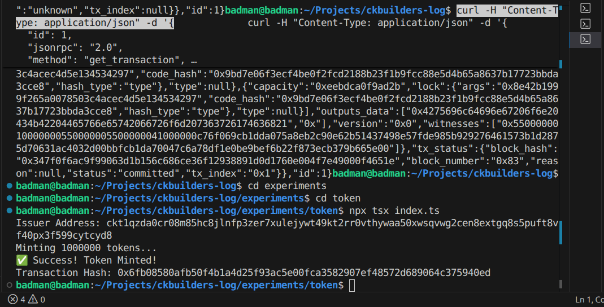
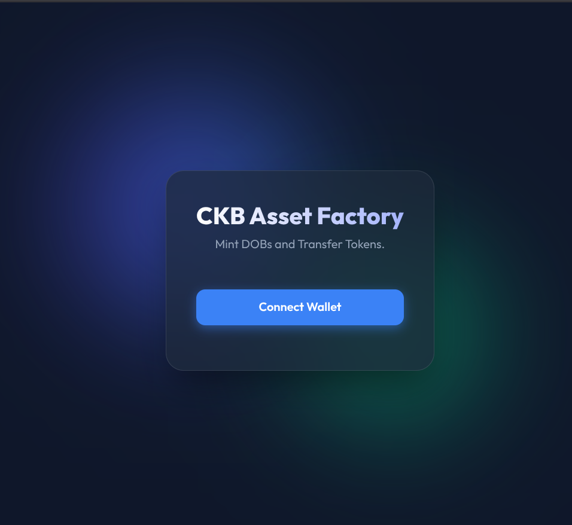
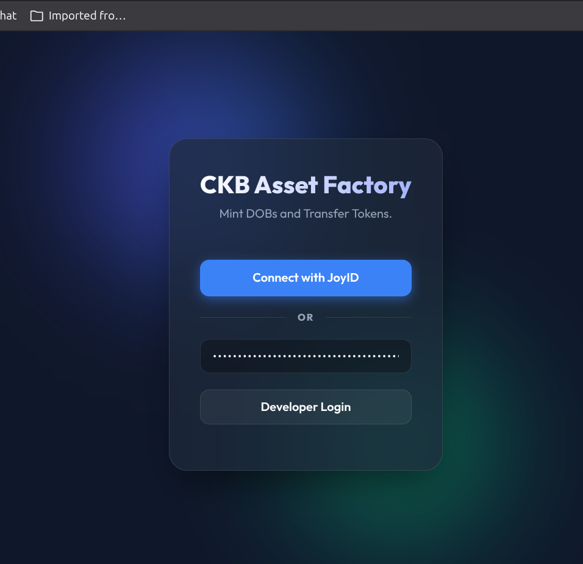
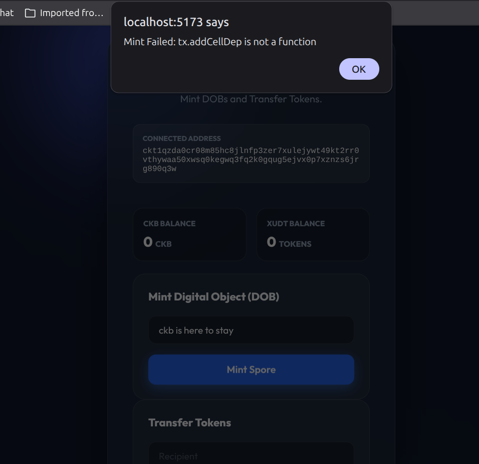
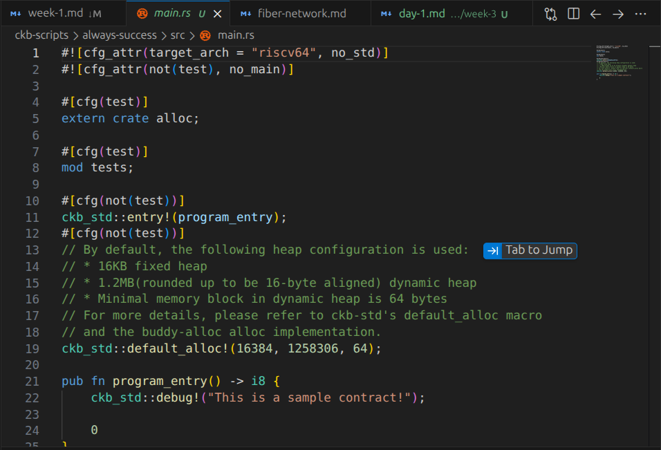
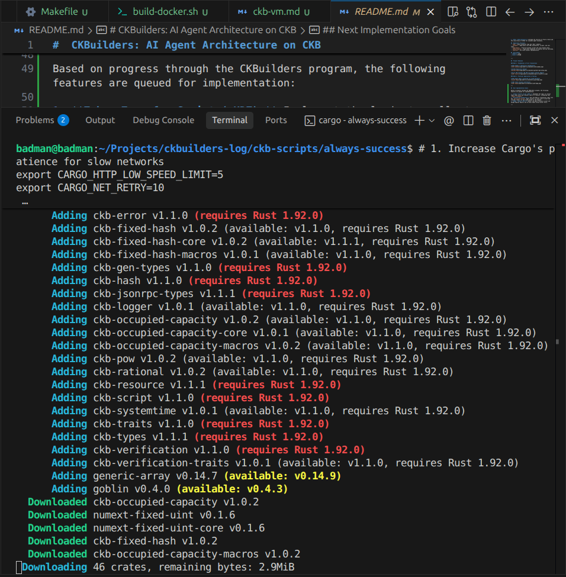

# Week 3 Report: Script Architecture & Custom Logic

**Period:** May 5 – May 12, 2026  
**Focus:** Mastering the CKB-VM, RISC-V script development, and completing the Asset Factory implementation.

---

## Executive Summary

Week 3 marked the transition from being a consumer of CKB scripts to an architect. The week began by finalizing the practical implementation of xUDT transfers in a React frontend and concluded with a deep-dive into the CKB-VM architecture and the scaffolding of a custom "Always Success" lock script. This progress establishes the foundation for building autonomous on-chain logic.

---

## Daily Breakdown

### Day 1 — xUDT Transfer Logic & UI
**Objective:** Implement functional token transfers in the `day-4-asset-factory`.
**Completed:** Added `completeInputsByUdt` logic to the dApp, allowing users to send tokens to any address. Upgraded the UI to a premium Glassmorphism design.

### Day 2 — The Spore Protocol (DOBs)
**Objective:** Complete the Beginner Handbook track by implementing Digital Object minting.
**Completed:** Integrated Spore (DOB) minting into the Asset Factory. Learned how 1 CKB = 1 Byte allows assets to "own" their storage space and provide zero-fee transfer possibilities.

### Day 3 — Script Architecture & Scaffolding
**Objective:** Transition to the Intermediate track by understanding the CKB-VM and setting up the toolchain.
**Completed:** Deep-dive into RISC-V and CKB-VM theory. Scaffolded the `always-success` script project using modern templates, bypassing the deprecated `Capsule` tool.

---

## Key Technical Takeaways

1. **Scripts are Cells:** Logic is stored exactly like data, requiring a capacity deposit (State Rent).
2. **The Spore Model:** DOBs are true on-chain assets that store their content directly in cells, ensuring permanent ownership.
3. **The Power of Abstraction:** Any cryptographic standard (Passkeys, Schnorr, etc.) can be implemented as a script without a hard fork.

---

## Week 3 Completion Status

- [x] Functional xUDT Transfer UI implemented
- [x] Spore Protocol (DOB Minting) implemented
- [x] CKB-VM & RISC-V architecture documented
- [x] Custom script project scaffolded in Rust
- [ ] Build and Deploy custom script (Week 4)

---

## Visual Evidence

### Day 1: Asset Factory & Token Minting

**Token Minting via Custom Script**

**CKB Asset Factory — Glassmorphism UI**

**Dual Auth: JoyID Passkey + Developer Login**

### Day 2: Spore Protocol (DOBs)

**Connected dApp with DOB Minting Interface**

### Day 3: Script Architecture & RISC-V

**Always-Success Lock Script in Rust**

**Building RISC-V Binary & CKB Crate Dependencies**

---

*Week 3 complete. 3 days of intensive focus, 100% handbook alignment.*
